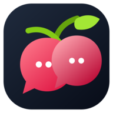
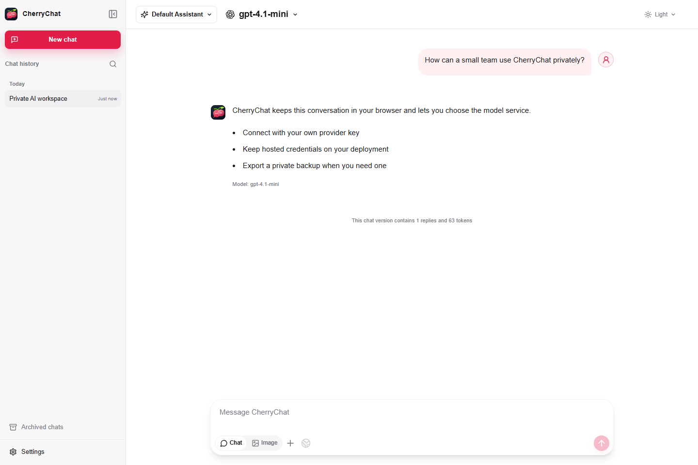
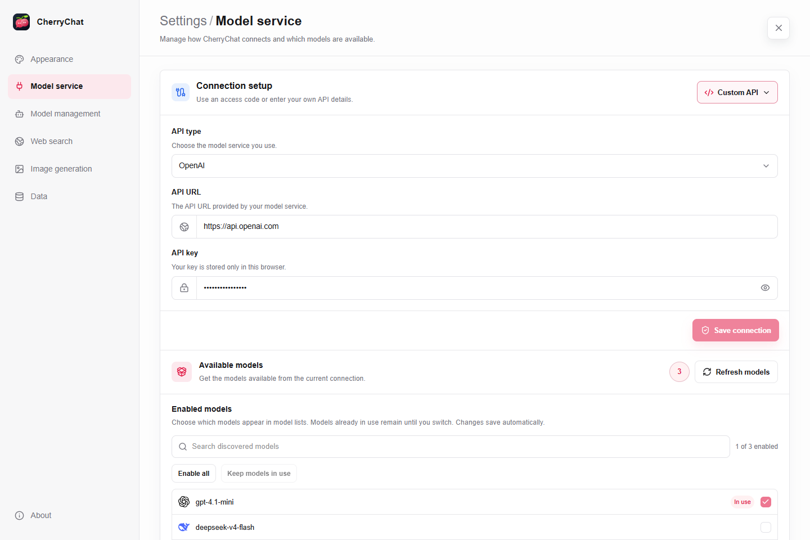
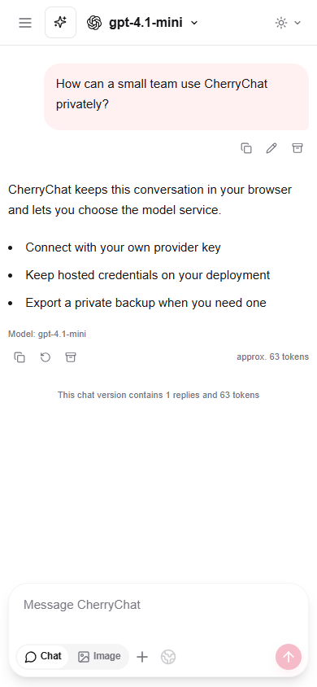

<div align="center">
  
  <h1>CherryChat</h1>
  <p><strong>轻量、隐私优先、可自托管的 Web AI 对话客户端。</strong></p>
  <p>适合希望使用浏览器本地数据、自带 API Key（BYOK）连接和简单 Vercel 部署的个人用户与小型团队。</p>
  <p><a href="./README.md">English</a> · <strong>简体中文</strong></p>
  <p>
    <a href="https://github.com/lin-z-z/CherryChat/actions/workflows/ci.yml"></a>
    <a href="./LICENSE"></a>
    
  </p>
</div>

> [!IMPORTANT]
> CherryChat 目前是持续验证中的 Preview（预览版）MVP。项目尚未提供账号、云同步、
> 组织权限、集中审计或计费控制。将 Hosted Key 实例分享给他人前，请先阅读
> [安全说明](./docs/SECURITY_CN.md)和[部署边界](./docs/DEPLOYMENT_CN.md)。

<p align="center">
  <a href="https://cherrychat-xi.vercel.app"><strong>体验 BYOK-only Demo</strong></a>
  ·
  <a href="https://vercel.com/new/clone?repository-url=https%3A%2F%2Fgithub.com%2Flin-z-z%2FCherryChat"><strong>部署到 Vercel</strong></a>
  ·
  <a href="./docs/README_CN.md"><strong>查看文档</strong></a>
  ·
  <a href="./CONTRIBUTING.md"><strong>参与贡献</strong></a>
</p>

可直接体验经过验证的 [公开 BYOK-only Demo](https://cherrychat-xi.vercel.app)。
当前地址使用稳定的 Vercel Production 别名，但没有配置项目所有者的模型、Hosted
access 或 Tavily 凭据；访客需要在浏览器中使用自己的服务凭据。Vercel 部署目标为
Production 不代表产品已经成熟，CherryChat 仍处于 Preview 阶段。



## 为什么选择 CherryChat

- **隐私优先的浏览器存储** —— 对话、分支、附件和设置保存在当前浏览器中；备份
  不包含 API Key、访问码、Cookie 或凭据摘要。
- **自带模型服务凭据** —— 使用自己的 Key 直连受支持的 API；如果浏览器 CORS
  不适合，也可使用只能访问部署固定上游的同源代理。
- **面向小团队的 Hosted access** —— Vercel 部署可通过访问码和签名 HttpOnly
  Session，共享一个固定的 OpenAI-compatible 上游。
- **多协议适配** —— 支持 OpenAI Chat Completions、OpenAI Responses、原生
  Anthropic、原生 Gemini、New API endpoint metadata 和通用 OpenAI-compatible
  Chat 接口。
- **实用对话工作流** —— 流式输出、推理展示、图片输入、Tavily 搜索、消息分支、
  本地搜索、助手、备份、导入导出、打印和可安装的 Web App manifest。
- **英文与简体中文** —— 首次进入时跟随浏览器语言，之后在本地保存你的选择。

## BYOK、托管访问与自托管

这三个词描述的是不同责任，并不是一回事：

- **自带 API Key（BYOK，Bring Your Own Key）**：每位用户填写模型 Provider
  发给自己的 API Key。模型用量计入该用户自己的 Provider 账号，CherryChat 不会
  提供模型额度。Key 为方便使用而保存在当前浏览器中，请求可以由浏览器直连
  Provider，也可以经过部署固定的同源路由。
- **托管访问（Hosted access）**：部署者把 Provider Key 配置在服务端环境变量中。
  访客不填写 Provider API Key，而是输入 CherryChat 访问码。请求使用部署者固定的
  模型白名单和 Provider 账号，因此费用和滥用风险由部署者承担。
- **自托管（Self-hosting）**：只表示你在自己的 Vercel 或服务器上运行 CherryChat，
  并不代表采用哪种凭据模式。一个自托管实例可以只开放 BYOK、只开放托管访问，
  或同时开放两种选择。

不要把 **Hosted access** 简写成 **Host**；“Host”还可能表示服务器、域名或部署
应用这个动作。请求路径和凭据边界见
[通俗对照表](./docs/DEPLOYMENT_CN.md#通俗术语说明)。

## 产品界面

### 连接与模型设置

在同一个设置工作区中管理 API 类型、Base URL、凭据、已发现模型、默认模型和
模型感知参数。



### 响应式移动端

同一套浏览器本地对话工作区会适配紧凑的移动端布局。



## 连接模式

| 模式          | 凭据归属   | 网络路径                                                                            |
| ------------- | ---------- | ----------------------------------------------------------------------------------- |
| 浏览器 BYOK   | 当前浏览器 | 绝对 Base URL 由浏览器直连，模型服务必须允许 CORS。                                 |
| 同源 BYOK     | 当前浏览器 | Base URL 留空时使用 `/api/models` 和 `/api/chat`，且只能访问部署固定的 `BASE_URL`。 |
| Hosted access | 部署端     | 登录后的访客通过固定 OpenAI-compatible Chat Completions 路由使用部署 Key。          |

Hosted access 不会把 CherryChat 变成任意模型服务代理。原生 Anthropic、Gemini、
OpenAI Responses 和 New API endpoint routing 属于 BYOK 能力；Hosted access
始终使用部署固定的 Chat Completions 适配器。完整说明见
[部署与连接模式](./docs/DEPLOYMENT_CN.md)。

## 快速开始

环境要求：Node.js 22 或更高版本，npm 11.9.0。

```powershell
npm ci
npm run dev
```

打开 `http://127.0.0.1:3000`。仅使用 BYOK 的本地实例不需要环境变量文件。进入
**设置 → 模型服务**，选择 API 类型，填写凭据和模型，然后保存连接。

只有在测试部署固定上游或 Hosted access 时，才需要把 `.env.example` 复制为
`.env.local`。不要提交真实 API Key、访问码或 `AUTH_SECRET`。

## 部署到 Vercel

[](https://vercel.com/new/clone?repository-url=https%3A%2F%2Fgithub.com%2Flin-z-z%2FCherryChat)

BYOK-only 部署不需要在 Vercel 中配置模型服务凭据。Hosted access 必须完整配置
`OPENAI_API_KEY`、`MODELS`、`ACCESS_CODE` 和 `AUTH_SECRET`；如需由部署端提供
搜索，再额外配置 `TAVILY_API_KEY`。

公开分享 Hosted 部署前，请同时设置上游消费限额，并为 `POST /api/auth` 配置
Vercel Firewall 限流规则。CherryChat 的进程内保护只是纵深防御，不是全局配额或
计费账本。

部署前请完整阅读 [Vercel 与环境变量指南](./docs/DEPLOYMENT_CN.md)。直接使用 CLI
部署时，提交到 Vercel 的源文件边界由仓库内的 `.vercelignore` 决定。

## 文档导航

- [中文文档索引](./docs/README_CN.md)
- [部署与连接模式](./docs/DEPLOYMENT_CN.md)
- [模型和协议兼容性](./docs/MODEL_COMPATIBILITY_CN.md)
- [安全模型与漏洞报告](./docs/SECURITY_CN.md)
- [数据存储、删除、备份与导出](./docs/DATA_CN.md)
- [路线图与暂缓边界](./docs/ROADMAP_CN.md)
- [开源许可证与归属（英文）](./LICENSES.md)

每份正式技术文档均提供英文和简体中文版本；如果两者出现语义差异，以英文版本
为基准。中英文版本应同步维护相同的能力、安全和部署边界。

## 安全与数据边界

- 浏览器保存的凭据只是便利存储，并非加密密码库；恶意同源 JavaScript 仍可能
  读取它们。
- 自定义绝对 BYOK URL 由浏览器直连。CherryChat 不会在 CORS 失败后悄悄改走
  任意目标服务端代理。
- Hosted 凭据保留在服务端，但公开部署仍需要 Firewall、上游消费限额、依赖审计
  和日志复核。
- 模型返回的原始 HTML 不会执行；远程 Markdown 图片需要用户明确加载，外部链接
  使用安全浏览器属性。
- 完整备份与普通导出不会包含凭据。

安全漏洞请通过
[GitHub Security Advisories](https://github.com/lin-z-z/CherryChat/security/advisories/new)
私密报告，不要把细节放进公开 Issue。提交复现材料前请先阅读
[安全策略](./docs/SECURITY_CN.md)。

## 参与贡献

欢迎提交 Bug、聚焦的功能建议、文档修复、测试和边界清晰的 Pull Request。请先
阅读 [CONTRIBUTING.md](./CONTRIBUTING.md)，运行其中列出的质量命令，并在提交前
移除凭据、私人对话、日志、本地工作流状态和生成报告。

## 许可证

CherryChat 为独立实现，使用 [MIT License](./LICENSE) 发布。主要第三方依赖及其
许可证信息记录在 [LICENSES.md](./LICENSES.md)。
