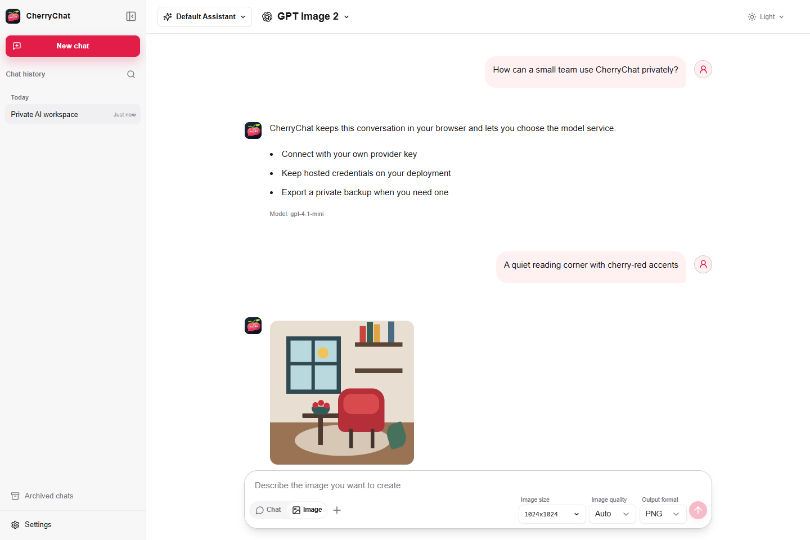

# 图片生成

[English](./IMAGE_GENERATION.md) · **简体中文**

[文档索引](./README_CN.md) · [部署指南](./DEPLOYMENT_CN.md) ·
[模型兼容性](./MODEL_COMPATIBILITY_CN.md) · [安全策略](./SECURITY_CN.md) ·
[数据行为](./DATA_CN.md) · [项目首页](../README_CN.md)

CherryChat 可以根据提示词生成图片，也可以使用有序参考图进行图片编辑。该功能使用
OpenAI-compatible Images API，并把完成的图片与对话一起保存在当前浏览器中。



## 能力边界

CherryChat 每次发送一个图片请求，并期望返回一个结果。纯文本请求使用
`POST /v1/images/generations`；带参考图的请求使用
`POST /v1/images/edits`，参考图通过重复且有序的 `image[]` 字段发送。

内置 BYOK Profile 使用模型 `gpt-image-2`。OpenAI-compatible 标签并不保证每个
Provider 都支持相同的尺寸、参考图、质量值、输出格式或响应字段。正式使用前应确认
Provider 的 Images 兼容性和账号权限。

## 快速开始

1. 打开 **设置 -> 模型服务**，选择 BYOK 使用的 **Custom API**，或 Hosted access
   使用的 **使用访问码**。
2. 打开 **设置 -> 图片生成**。
3. BYOK 模式填写图片服务 URL 和 API Key 后保存；Hosted access 从部署者开放的
   Profile 中选择。
4. 返回对话，使用图片图标把输入框从文本聊天切换到图片生成。
5. 填写提示词，可选添加参考图，选择当前可用的尺寸、质量和输出参数，然后发送。

图片模式有独立的有序参考图草稿，不复用普通聊天附件。切回聊天不会改变普通聊天
附件的数量限制或行为。

## BYOK 连接

BYOK 图片设置只包含一个服务 URL 和一个 API Key。模型固定为 `gpt-image-2`；本地
不会开放模型 ID 或 Profile 管理。

- 客户端显示的默认服务 URL 是 `https://api.openai.com`。
- 填写服务根地址或以 `/v1` 结尾的地址。不要填写完整的
  `/v1/images/generations` 或 `/v1/images/edits` 路径。
- 请求由浏览器直接发送到配置的服务，因此 Provider 必须通过 CORS 允许 CherryChat
  Origin。
- API Key 保存在独立的浏览器凭据记录中，不会进入备份或对话导出。

仓库内置 URL 和模型只是 UI 默认值，不代表项目提供免费凭据。每位 BYOK 用户使用
并支付自己的 Provider 账号。

## Hosted 连接

Hosted 图片生成是可选能力，并要求先完成 Hosted access 配置。浏览器只会收到
Profile ID、名称、模型 ID 和尺寸模式；部署方 API Key 与上游 URL 保留在服务端。

### 单个 Hosted Profile

一个由部署方付费的 Profile 可以使用旧版三变量：

```env
IMAGE_GENERATION_API_KEY=replace-with-image-provider-key
IMAGE_GENERATION_BASE_URL=https://api.openai.com
IMAGE_GENERATION_MODEL=gpt-image-2
```

三个值必须一起配置，并且都没有运行时回退值。省略完整变量组会禁用 Hosted 图片
生成。

### 多个 Hosted Profile

使用 `IMAGE_GENERATION_PROFILES` 替代旧版三变量。它是包含 1 至 32 个严格对象的
JSON 数组：

```json
[
  {
    "id": "standard",
    "name": "Standard",
    "apiKey": "replace-with-image-provider-key",
    "baseUrl": "https://api.openai.com",
    "model": "gpt-image-2",
    "sizeMode": "auto"
  }
]
```

Profile ID 必须唯一。`IMAGE_GENERATION_DEFAULT_PROFILE` 默认使用第一项 Profile
ID；显式设置时必须匹配已配置 Profile。有效 `sizeMode` 为 `auto`、`fixed` 和
`custom`。JSON 列表不能与旧版三变量中的任何一项混用。

完整 Hosted access 变量组、环境变量默认值、Vercel 步骤和公开部署检查见
[部署与连接模式](./DEPLOYMENT_CN.md)。

## 生成或编辑图片

- 必须提供非空提示词，并且当前有可用图片 Profile。
- 最多添加并排序 16 张 PNG、JPEG、WebP、HEIC 或 HEIF 参考图。HEIC/HEIF 输入会在
  请求前转换；系统会在 Multipart Body 和已保存生成快照中保留参考图顺序。
- **停止**会取消当前请求。失败、停止或完成的尝试都会保留在对话中，因此重试会
  继续使用原始 Profile、参数、连接 Scope 和参考图顺序。
- 完成结果保存为本地图片附件。用户可以下载，也可以直接复用为参考图，而不会复制
  底层 Blob。

## Profile 与参数

| 控件     | 默认值 | 契约                                 |
| -------- | ------ | ------------------------------------ |
| 分辨率   | `1K`   | 默认比例下解析为 `1024x1024`。       |
| 图片比例 | `1:1`  | 其他比例取决于所选 Profile。         |
| 质量     | `auto` | 其他值为 `low`、`medium` 和 `high`。 |
| 输出格式 | `png`  | 其他值为 `jpeg` 和 `webp`。          |
| 压缩率   | 无     | JPEG/WebP 可设置 0 至 100 的整数。   |
| 参考图   | 无     | 最多 16 张有序图片。                 |

`sizeMode=custom` 的 Profile 会开放自定义尺寸。`sizeMode=auto` 只对精确模型 ID
`gpt-image-2` 开放；`fixed` 保留兼容的固定尺寸控件。CherryChat 会把自定义宽高
规整为有界且按 16 Pixel 对齐的值，但上游 Provider 最终仍可拒绝不支持的尺寸。

## 数据、备份与导出

图片服务设置、生成参数、消息快照、参考图和生成结果都是浏览器本地数据。生成快照
会记录模型、连接 Scope、尺寸、质量、格式、压缩率和有序参考图 ID，确保刷新与重试
不会静默使用新的全局设置。

Backup v2 包含生成快照和引用/生成的图片附件，并在导入时重新映射附件 ID。它不会
包含 BYOK 图片 API Key、访问码、Cookie 或部署凭据。JSON 对话导出保留消息元数据；
带图片的 Markdown 导出会生成使用相对附件路径的 ZIP。

移动或分享归档前请阅读[数据与备份行为](./DATA_CN.md)。

## 安全与限制

- 浏览器 BYOK 会把图片 API Key 直接发送到配置的绝对服务 URL。CherryChat 不会在
  CORS 失败后静默改走代理。
- Hosted 浏览器只会在同源与签名 Session 校验后调用同源
  `POST /api/image-generation`。服务端选择完整白名单 Profile，并拒绝重定向。
- Hosted 图片请求体默认上限为 8 MiB，默认超时为 300 秒。运维方可使用文档列出的
  环境变量修改。Hosted 图片的进程内并发上限为 2。
- 单张生成图片上限为 20 MiB，解析响应上限为 32 MiB。Hosted 返回 URL 必须与配置
  的上游同源，并在不携带凭据、不允许重定向的情况下下载和校验图片。
- 公开 Hosted 部署仍需设置上游消费控制和滥用响应方案。进程内 Guard 不是全局配额
  或计费账本。

完整信任边界见[安全策略与模型](./SECURITY_CN.md)。

## 故障定位

- **图片模式不可用：** 保存 BYOK 图片 API Key，或让运维方配置至少一个 Hosted
  图片 Profile。
- **浏览器无法访问服务：** 检查 Base URL 和 Provider CORS 策略。填写服务根地址或
  `/v1` 地址，不要填写完整 Images Endpoint。
- **未授权或被拒绝：** 确认账号拥有图片模型权限，并重新填写 BYOK Key。Hosted
  用户不能替换部署凭据。
- **Profile 或参数不可用：** 选择已开放的 Hosted Profile，并使用其 `sizeMode` 与
  模型 ID 支持的控件。
- **请求过大：** 减少参考图数量或尺寸。Hosted 部署可能使用比浏览器 BYOK 更低的
  请求上限。
- **超时或结果不可信：** 检查 Provider 状态和部署日志后再重试。Hosted 会按设计
  拒绝跨 Origin 结果 URL 和重定向。
